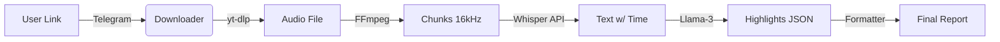

<div align="center">

# ⚽ AI Match Summarizer

[](https://python.org)
[](https://www.docker.com/)
[](https://openai.com/)
[](LICENSE)

<h3>
  <a href="#-english">English</a> | <a href="#-русский">Русский</a> | <a href="#-中文">中文</a>
</h3>

<p align="center">
  <strong>Turn boring full-match replays into spicy highlights in minutes.</strong><br>
  Превращает полные записи матчей в текстовые хайлайты за минуты.
</p>


<br>
<em>(Screenshot: Bot delivering a match report / Скриншот работы бота)</em>

</div>

---

<a name="-english"></a>
## 🇬🇧 English

**AI Match Summarizer** is a fully containerized pipeline that watches sports matches for you. It downloads video from YouTube/Twitch, transcribes the commentary using **Whisper**, and uses **LLMs** (Llama 3, GPT-4) to extract key moments like goals, fouls, and dramatic plays.

### ⚡ Key Features
*   **🤖 Telegram Bot:** One-click interface. Send a link -> Get a report.
*   **🧠 Intelligent Analysis:** Filters out "filler" commentary. Only keeps what matters.
*   **🌍 Smart Proxying:** Built-in SOCKS5/HTTP proxy support for restricted regions (yt-dlp + API).
*   **🔧 Self-Healing:** Auto-retries on Rate Limits (429) and network errors.
*   **🐳 Docker Ready:** Pre-configured with FFmpeg, Node.js, and Python environment.

### 🏗 Architecture


### 🚀 Quick Start

1.  **Clone & Setup**
    ```bash
    git clone https://github.com/your-username/match-transcriber.git
    cd match-transcriber
    cp .env.example .env
    ```

2.  **Configure `.env`**
    ```ini
    TELEGRAM_BOT_TOKEN=your_token
    API_BASE_URL=https://api.groq.com/openai/v1
    API_KEY=your_key
    PROXY_URL=socks5://host.docker.internal:1080  # Optional
    ```

3.  **Run with Docker**
    ```bash
    docker-compose up --build -d
    ```

### 🗺 Roadmap
- [ ] Support for Twitch Live Streams
- [ ] Video clipping (sending video clips instead of text)
- [ ] Multi-language support for transcription
- [ ] Web Interface (FastAPI + React)

---

<a name="-русский"></a>
## 🇷🇺 Русский

**AI Match Summarizer** — это автоматизированный инструмент для создания саммари (хайлайтов) спортивных матчей. Бот слушает комментатора, понимает эмоции и контекст, и создает хронику матча с таймкодами. Идеально для тех, кто пропустил игру, но не хочет смотреть 90 минут.

### ⚡ Возможности
*   **🤖 Телеграм Бот:** Минимум действий. Кинул ссылку — получил отчет.
*   **🧠 Умный Фильтр:** LLM отличает "опасный момент" от "перепасовки в центре поля".
*   **🌍 Прокси:** Полная поддержка SOCKS5/HTTP прокси для обхода блокировок (работает и для скачивания видео, и для AI).
*   **🔧 Надежность:** Автоматическая обработка ошибок API (Rate Limits) и проблем с сетью.
*   **🐳 Docker:** Все зависимости (FFmpeg, Node.js, Python) уже внутри контейнера.

### 📂 Структура проекта
```text
.
├── src/
│   ├── bot.py          # Логика Telegram бота
│   ├── processor.py    # Ядро: Whisper + LLM анализ
│   ├── downloader.py   # Обёртка над yt-dlp
│   └── config.py       # Настройки Pydantic
├── downloads/          # Временные файлы (очищаются автом.)
├── reports/            # Готовые JSON отчеты
├── docker-compose.yml  # Запуск
└── Dockerfile          # Сборка образа
```

### 🚀 Установка

1.  **Скачайте проект**
    ```bash
    git clone https://github.com/your-username/match-transcriber.git
    cd match-transcriber
    cp .env.example .env
    ```

2.  **Настройте `.env`**
    Вставьте свой API ключ (Groq/OpenAI) и Токен Бота.
    *Для пользователей из РФ есть настройка `PROXY_URL`.*

3.  **Запустите**
    ```bash
    docker-compose up --build -d
    ```
    Бот готов к работе!

---

<a name="-中文"></a>
## 🇨🇳 中文

**AI Match Summarizer** 是一款全自动工具，通过分析比赛解说语音生成精彩片段摘要。它结合了 **Whisper**（语音转文字）和 **LLM**（语义分析），为您提炼出比赛中最关键的时刻。

### ⚡ 主要特性
*   **🤖 Telegram 机器人:** 发送 YouTube 链接，即可获取带时间轴的战报。
*   **🧠 智能分析:** 自动过滤无意义的闲聊，只保留进球、红黄牌等关键事件。
*   **🌍 代理支持:** 内置 SOCKS5/HTTP 代理支持，解决网络访问问题。
*   **🐳 Docker:** 一键部署，无需手动配置复杂的 Python 和 FFmpeg 环境。

### 🚀 快速开始

1.  **克隆代码**
    ```bash
    git clone https://github.com/your-username/match-transcriber.git
    cd match-transcriber
    cp .env.example .env
    ```

2.  **配置**
    编辑 `.env` 文件，填入 API Key 和 Bot Token。

3.  **运行**
    ```bash
    docker-compose up --build -d
    ```

---

<div align="center">
  <sub>Built with ❤️ by <a href="https://github.com/your-username">fuckseer</a></sub>
  <br>
  <sub>If you like this project, please give it a star ⭐️</sub>
</div>
